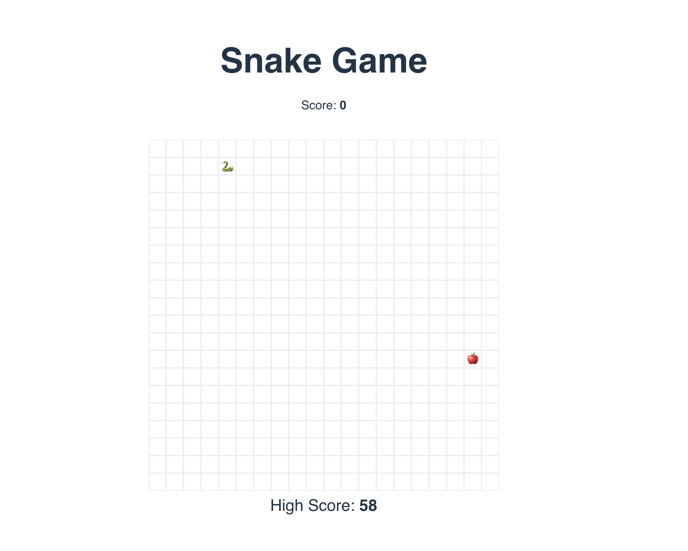
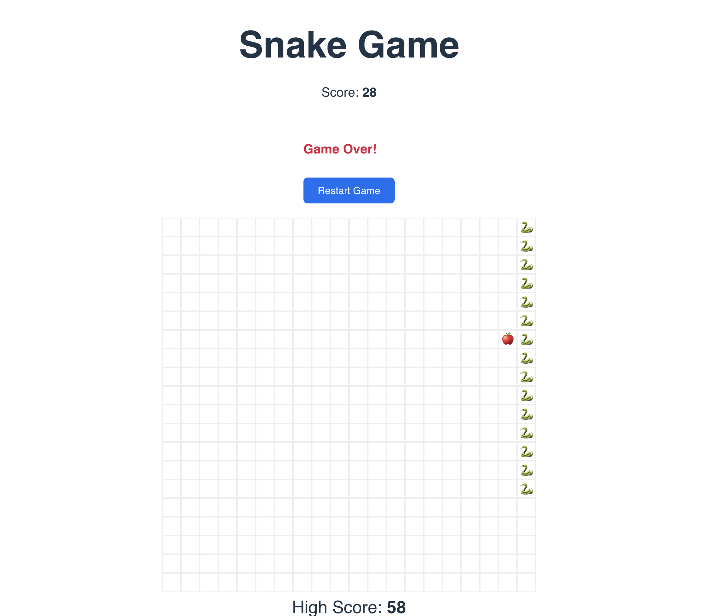

# 🐍 Retro Snake Game

A nostalgic browser-based Snake game built with **React** and **TypeScript**. Inspired by the classic Nokia-era Snake, complete with score tracking and clean pixel grid visuals.

Live Demo: [https://snake-retro.vercel.app](https://snake-retro.vercel.app)

---

## Features

- Arrow key controls (Up, Down, Left, Right)
- Grid-based snake rendering using CSS blocks
- Score tracking
- Persistent high score using `localStorage`
- Game over detection with restart option
- Responsive and retro aesthetic

---

## Tech Stack

- React + TypeScript
- Vite for dev & build tooling
- LocalStorage for high score
- CSS grid layout for game visuals

---

## Getting Started

```bash
git clone https://github.com/your-username/snake-game.git
cd snake-game
npm install
npm run dev
```

---

## Screenshots

| Gameplay | Game Over |
|----------|-----------|
|  |  |

---

## Customization Ideas

- Add boot animation or loading screen
- Add audio: eat sound, crash beep
- Snake themes (dark mode, neon, emoji-mode)
- Timer-based survival mode

---

## License

MIT License

---

Made with ❤️ by [@heyshiks](https://github.com/heyshiks)
